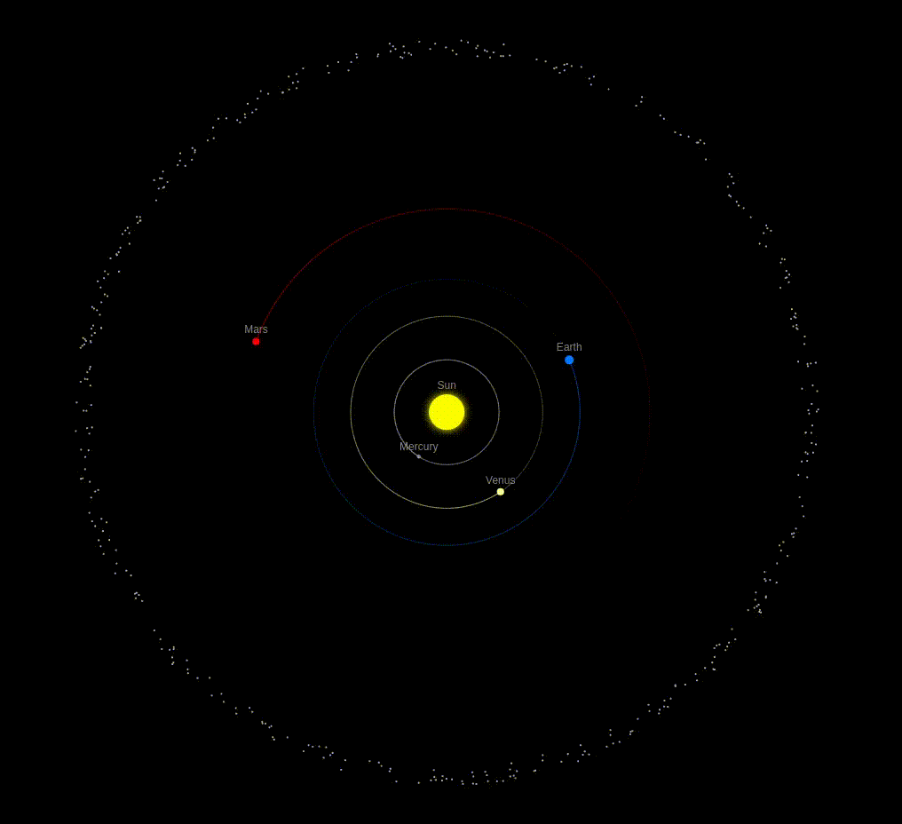

# Solar-JS: N-body solar system simulation written in JavaScript

## First steps

1. Launch a web server for the game using the command `npm run dev` in a shell
2. Open the game under <https://localhost:5173>
